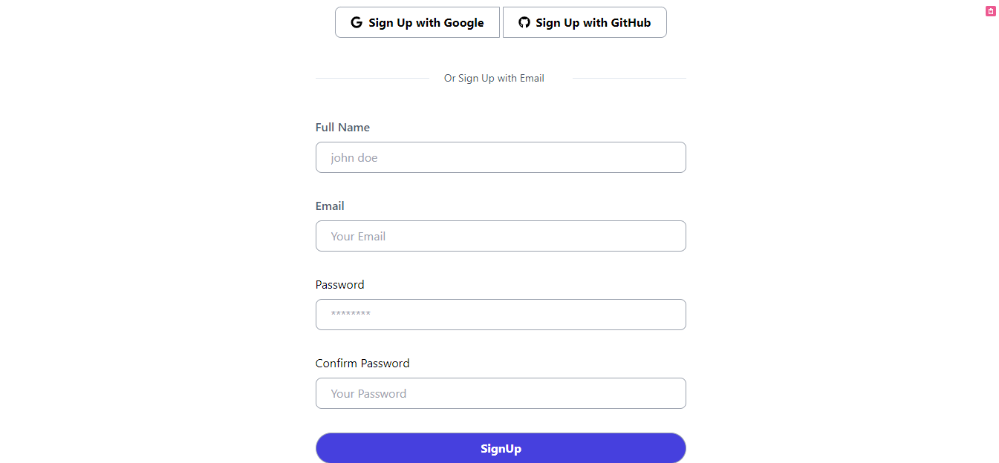
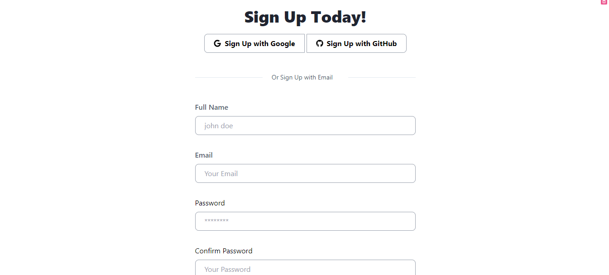
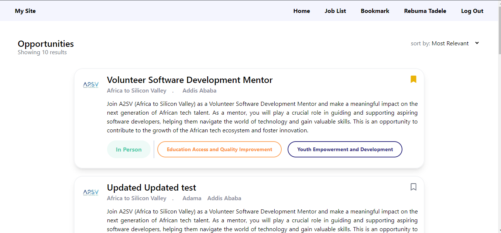
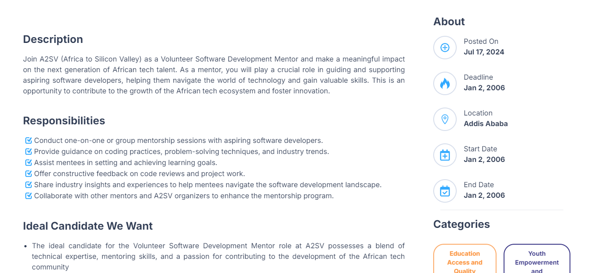
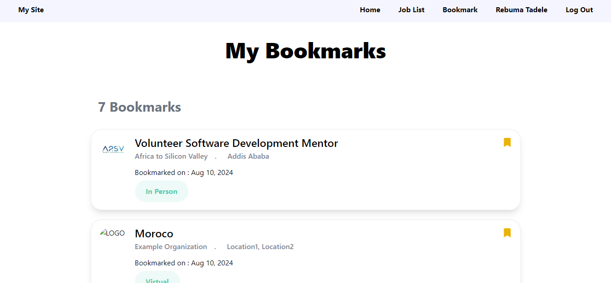
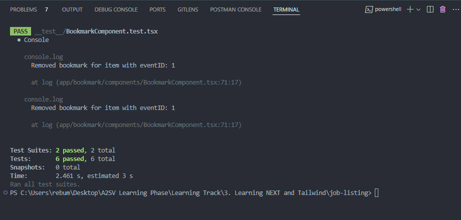

# Job Listings Web Application

This is a web application for browsing job listings. it is implemented with nextjs and tailwindcss. Users can view all available job opportunities, and view detailed information about each job.
 
## Features
- HomeScreen
- Signup page and Signin
- OTP page
- Display all job listings
- View detailed information for each job
- bookmarking
- deleting and adding to bookmarks
- Tested using jest

## Screenshots

### Homepage


### Job Details Page









### Bookmarking


### Testing


## Installation

1. Clone the repository:
   ```sh
   git clone https://github.com/rebumatadele/Akil-job-listing-site.git
   ```
2. Navigate to the project directory:
   ```sh
   cd Akil-job-listing-site
   ```
3. Install the dependencies:
   ```sh
   npm install
   ```

## Usage

1. Start the development server:
   ```sh
   npm run dev
   ```
2. Open your browser and navigate to `http://localhost:3000`.
